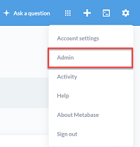

# Connecting to Metabase
{: .no_toc}

[Metabase](https://www.metabase.com/) is an open source business intelligence tool used for exploring data and producing dashboards.

1. Topic ToC
{:toc}

### Install Metabase

For more information about creating an instance and getting started with Metabase, see [Metabase documentation](https://www.metabase.com/docs/latest/operations-guide/running-the-metabase-jar-file.html) to create an instance.

### Download required files

After setting up Metabase, download the following files and save them to the Metabase `/plugins` directory on your host system. By default, `/plugins` is a subdirectory of the directory where the `metabase.jar` file executes.

* Download the latest Firebolt JDBC driver from its [GitHub Releases page](https://github.com/firebolt-db/jdbc/releases).
* Download the latest Firebolt Metabase driver from its [GitHub Releases page](https://github.com/firebolt-db/metabase-firebolt-driver/releases).

### Creating a connection

You are now ready to run Metabase with your Firebolt databases.

1. Use a web browser to navigate to the home page of your Metabase instance.

    

2. From the **Settings** menu, click the **Admin** link:

    

3. From the Metabase **Admin** page, click the **Databases** link at the top of the page. Then click **Add database**.  

    

4. Select **Firebolt** from the list under **Database type**.

5. Enter the rest of the connection parameters needed to connect to Firebolt as follows:

| Field                          | Description                                                                  | 
| ------------------------------ | ---------------------------------------------------------------------------- |
| **Name**                       | A title to refer to your database in Metabase. For simplicity, we recommend using the same name as your Firebolt database. | 
| **Host**                       | The Firebolt host to connect to. It is always `api.app.firebolt.io`.         |              
| **Port**                       | The port to use for the connection. It is `8123`.                            |              
| **Database name**              | The name of the Firebolt database to connect to.                             |              
| **Username**                   | The name of the Firebolt user to connect with, e.g. `janedoe@mycompany.com`. | 
| **Password**                   | The password associated with the username above.                             | 
| **Additional JDBC parameters** | Any additional JDBC parameters to pass along with the connection, such as `engine=<my_database_engine_1>`. See [here](https://docs.firebolt.io/developing-with-firebolt/connecting-with-jdbc.html#available-connection-parameters) for a list of all available JDBC connection parameters. | 

Be sure to click **Save** after entering all your information. After saving, you should get a message saying your Firebolt database was successfully added.
