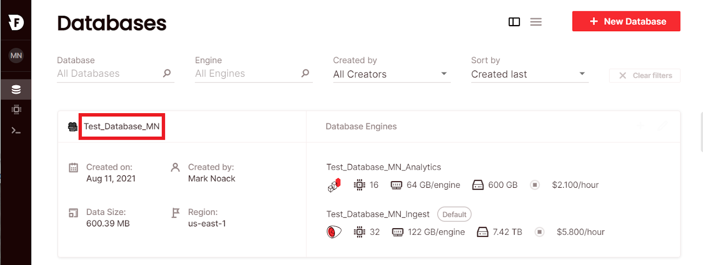

# Integrations

Firebolt is working with an expanding roster of services and applications to utilize our optimized performance speed.

The services listed below include tools that have been customized by our partners to connect with Firebolt. Many services not explicitly listed here can still operate with Firebolt's architecture through our [drivers and adapters](connecting-via-jdbc.md) for general connection use.

* [**Apache Airflow**](other-integrations/setting-up-airflow-jdbc-to-firebolt.md)
* [**DBeaver**](other-integrations/setting-up-dbeaver-jdbc-connection-to-firebolt.md)
* [**dbt**](data-integration-and-transformation/connecting-with-dbt.md)
* [**Keboola**](data-integration-and-transformation/connecting-to-keboola.md)
* [**Looker**](business-intelligence/connecting-to-looker.md)
* [**SQLAlchemy**](../developing-with-firebolt/connecting-with-sqlalchemy.md)\*\*\*\*
* [**Tableau**](business-intelligence/setting-up-tableau-desktop-jdbc-to-firebolt.md)

### Common connection parameters

Most integrated services require the same parameters from Firebolt to establish a connection. Unless otherwise noted, connection details for Firebolt can be found as indicated below.

* **Username**: The email address used to create your Firebolt account.
* **Password**: The password used to create your Firebolt account.
* **Database**: The name of your database. From the Database view on the Firebolt Manager, your database name can be found as indicated below:

*   **Engine**: The engine being used to query your database. Some services will automatically use your default engine unless directed to use another.

    From the Database view on the Firebolt Manager, the engine names can be found in the image below:

