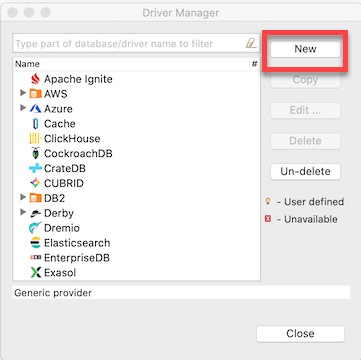
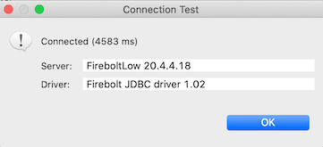

# Connecting to DBeaver

DBeaver is a free open-source administration tool used to simplify working across a range of different database types. DBeaver can connect to Firebolt databases using our JDBC driver.

## Adding driver configuration in DBeaver

1\. Download the [Firebolt JDBC driver](../connecting-via-jdbc.md#downloading-the-driver).

2\. Open the driver manager dialog: From the top navigation menu click on **Database** > **Driver Manager**.

3\. Select **New** to add a new driver:&#x20;

4\. In order to add the driver, fill in the following parameters:

* Driver Name: `Firebolt`.
* Class Name: `com.firebolt.FireboltDriver`.
* Under **Libraries**, click **Add File** and choose the JDBC driver downloaded in step 1 above.

5\. Select **OK** after completing these steps.&#x20;

## Adding a database in DBeaver

1\. From the top navigation menu, select **Database** > **New Database Connection**.

2\. Type `Firebolt` in the search box, and select it from the list of databases.

3\. Select **Next**.

4\. Fill in the following parameters:

| Parameter    | Description                                                                                                                                                                                                                                                                                                                                                                                                                                                                                                                                                                                                                                     |
| ------------ | ----------------------------------------------------------------------------------------------------------------------------------------------------------------------------------------------------------------------------------------------------------------------------------------------------------------------------------------------------------------------------------------------------------------------------------------------------------------------------------------------------------------------------------------------------------------------------------------------------------------------------------------------- |
| **JDBC URL** | 
Use the following URL: 

<code>jdbc:firebolt://api.app.firebolt.io/&#x3C;db_name></code>

In the path above, be sure to replace <code>&#x3C;db_name></code> with the name of your Firebolt database. This enables you to query the database using its default engine. 

If you wish to use a different engine than your default, use the following URL:

<code></code>

<code>jdbc:firebolt://api.app.firebolt.io/&#x3C;db_name>?engine=&#x3C;engineName></code>

In the path above, replace <code>&#x3C;engineName></code> with the name of the engine you would like to use.
 |
| **Username** | Your Firebolt username.                                                                                                                                                                                                                                                                                                                                                                                                                                                                                                                                                                                                                         |
| **Password** | Your Firebolt password                                                                                                                                                                                                                                                                                                                                                                                                                                                                                                                                                                                                                          |

5\. Select **Test Connection** (make sure to start your database before you start the test). A successful connection test looks as follows:&#x20;

6\. Select **Finish. **

## Querying your Firebolt database

1. In the database navigator, right-click on the database connection and select **SQL Editor**. If a pop-up window appears, select **New Script**:&#x20;

2\. The SQL editor should now open and you can run your queries.
