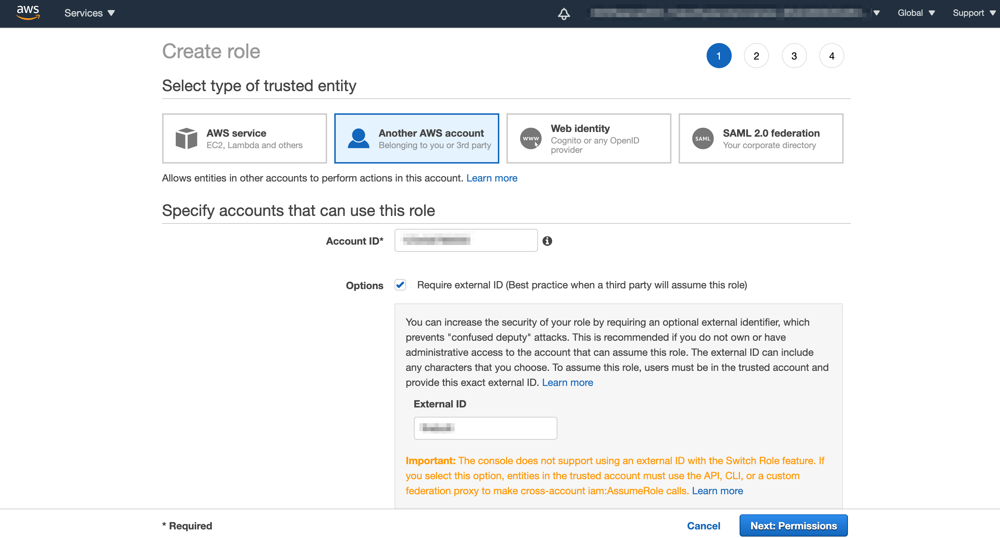
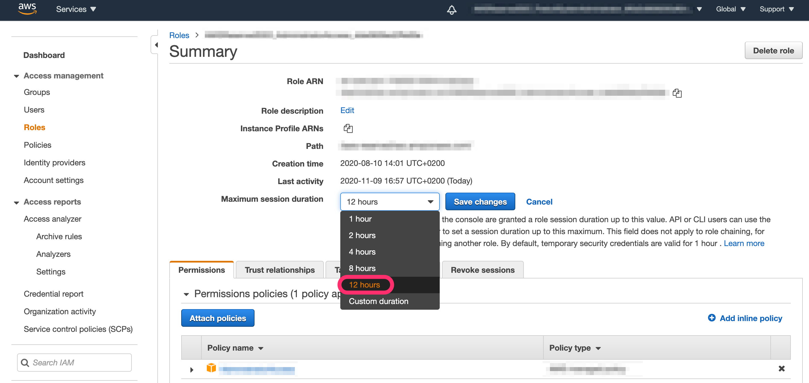

# Using AWS roles to access Amazon S3
{: .no_toc}
Firebolt uses AWS Identity and Access Management \(IAM\) permissions to load data from Amazon S3 into Firebolt. This requires you to set up permissions using the AWS Management Console. You have two options to specify credentials with the appropriate `CREDENTIALS` when you create an external table:

* You can provide **key credentials** associated with an IAM principal that has the required permissions
* You can specify an **IAM role** that Firebolt assumes for the appropriate permissions.

This topic provides instructions for setting up an IAM role and an AWS IAM permissions policy that allows the actions that Firebolt requires to read data from an S3 location.

1. Topic ToC
{:toc}

## Create an IAM permissions policy

1. Log in to the [AWS Identity and Access Management \(IAM\) Console](https://console.aws.amazon.com/iam/home#/home).
2. From the left navigation panel, choose **Account settings**.
3. Under **Security Token Service \(STS\),** in the **Endpoints** list, find the **Region name** where your account is located. If the status is **Inactive**, choose **Activate**.
4. Choose **Policies** from the left navigation panel.
5. Click **Create Policy.**
6. Click the **JSON** tab.
7. Add a policy document that will allow Firebolt to access the S3 bucket and folder.

   The following policy \(in JSON format\) provides Firebolt with the required permissions to unload data using a single bucket and folder path. Copy and paste the text into the policy editor \(make sure to replace `<bucket>` and `<prefix>` with the actual bucket name and path prefix\).

   ```javascript
   {
      "Version": "2012-10-17",
      "Statement": [
          {
              "Effect": "Allow",
              "Action": [
                  "s3:GetObject",
                  "s3:GetObjectVersion"
              ],
              "Resource": "arn:aws:s3:::<bucket>/<prefix>/*"
          },
          {
              "Effect": "Allow",
              "Action": "s3:GetBucketLocation",
              "Resource": "arn:aws:s3:::<bucket>"
          },
          {
              "Effect": "Allow",
              "Action": "s3:ListBucket",
              "Resource": "arn:aws:s3:::<bucket>",
              "Condition": {
                  "StringLike": {
                      "s3:prefix": [
                          "<prefix>/*"
                      ]
                  }
              }
          }
      ]
   }
   ```

   * If you encounter the following error: `Access Denied (Status Code: 403; Error Code: AccessDenied)` - try to remove the following condition from the IAM policy:

   ```javascript
              "Condition": {
                  "StringLike": {
                      "s3:prefix": [
                          "<prefix>/*"
                      ]
                  }
              }
   ```

8. Choose **Review policy**, enter the policy **Name** \(for example, _firebolt-s3-access_\), enter an optional **Description**, and then choose **Create policy**.

{: .warning}
Setting the `s3:prefix` condition key to `*` grants access to all prefixes in the specified bucket for the action to which it applies.

## Create the IAM role

In the AWS Management Console, create an AWS IAM role. The IAM role will assume the permissions you defined in step 1 to access the S3 locations where your data files are saved.

1. Log in to the [AWS Identity and Access Management \(IAM\) Console](https://console.aws.amazon.com/iam/home#/home).
2. From the left navigation panel, choose **Roles**, and then choose **Create role**.

   

3. Select **Another AWS account** as the trusted entity type.
4. In the **Account ID** field, enter your Firebolt **AWS Account ID**. Users with Account Admin privileges can view this value in the [Account & Billing window](https://app.firebolt.io/account-info).
5. If you select **Require external ID**, enter a value of your choosing and make a note of it.
6. Choose **Next**.
7. Begin typing the name of the policy you created in [Step 1: Create an IAM permissions policy](#create-an-iam-permissions-policy) in the search box, select it from the list, and then choose **Next**.
8. Enter a **Name** and optional **Description** for the role, and then choose **Create role**.

   You have now created an IAM permissions policy, an IAM role for Firebolt access, and attached the permissions policy to the role.

9. Record the **Role ARN** listed on the role summary page.

## Increase the max session duration for your AWS role

1. Log in to the [AWS Identity and Access Management \(IAM\) Console](https://console.aws.amazon.com/iam/home#/home).
2. From the left navigation panel, choose **Roles**.
3. Begin typing the name of the role that you created in [Step 2: Create the IAM role](#create-the-iam-role), and then select it from the list.
4. In the summary section, locate the **Maximum session duration** field. Click **Edit**
5. Choose _12 hours_ from the list, and then click **Save changes.**



## Specify the IAM role in the external table definition
Specify the role ARN in the [CREDENTIALS](../sql-reference/commands/ddl-commands.md#syntaxauthenticating-using-an-iam-role) of the `CREATE EXTERNAL TABLE` statement. If you specified an external ID, make sure to specify it in addition to the role ARN. When you use an INSERT INTO statement to ingest data from your source to a fact or dimension table, Firebolt assumes the IAM role for permissions to read from the location specified in the external table definition.
