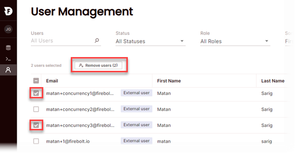

# Managing Firebolt users

Each user in Firebolt has an email address that serves as the Firebolt username. Each user is also assigned a role that determines the user's permissions within the account. This topic explains the permissions associated with each user role, followed by instructions for Account Admins for adding and removing users.

* Topic ToC
{:toc}

# Firebolt roles and allowed actions

Each user in a Firebolt account is assigned one of the roles listed below.

* Viewer
* DB Admin
* Account Admin

Permissions apply throughout the account. The actions allowed for each role are listed below.

| Action                           | Viewer | DB Admin | Account Admin |
| :----------------------------    | :----- | :------- | :------------ |
| **Databases**                    |        |          |               |
| View all databases in account    | ✅     | ✅       | ✅            |
| Create databases                 | ❌     | ✅       | ✅            |
| Drop (delete) databases          | ❌     | ✅       | ✅            |
| **Engines**                      |        |          |               |
| View all engines in account      | ✅     | ✅       | ✅            |
| Create engines                   | ❌     | ✅       | ✅            |
| Drop (delete) engines            | ❌     | ✅       | ✅            |
| Update engines                   | ❌     | ✅       | ✅            |
| Start engines                    | ❌     | ✅       | ✅            |
| Stop engines                     | ❌     | ✅       | ✅            |
| **Tables and table data**        |        |          |               |
| Create tables                    | ✅     | ✅       | ✅            |
| Drop (delete) tables             | ✅     | ✅       | ✅            |
| Ingest (INSERT INTO)             | ❌     | ✅       | ✅            |
| Run analytics queries            | ✅     | ✅       | ✅            |
| **Accounts and users**           |        |          |               |
| View Firebolt AWS Account #      | ❌     | ❌       | ✅            |
| Invite, update, and remove users | ❌     | ❌       | ✅            |

## Adding users
An Account Admin invites a user to join a Firebolt account. The invitation is sent to the user's email address, which serves as the user's Firebolt username after the user accepts the invitation. Account Admins can only invite users with organizational domains, such as `you@anycorp.com`. Firebolt does not support usernames with personal email addresses, such as `me@gmail.com` or `you@outlook.com`. Before sending the invitation, the Account Admin chooses the role associated with the user.

**To add a Firebolt user or users to a Firebolt account**

1. In the Firebolt Manager, choose the **User Management** icon in the navigation pane. If the icon isn't available, you don't have Account Admin permissions.  
  

2. Choose **Invite Users**.

3. Under **Add emails**, enter the business email of the user to invite. Use commas to separate multiple email addresses.

4. Under assign roles, choose the role to associate with each user listed, and then choose **Invite**.  

  An invitation email is sent to the email address(es) that you entered. The invitation has a link to accept the invitation and log in to Firebolt for the first time.

## Changing a user's role

Account Admins can edit a user's role. 

**To change a user's role**

1. To the far right of a user in the User Management list, select the ellipses and then choose **Edit User Details**.

2. Choose the role to assign, and then choose **Update user details**.

## Removing users

The **Remove users** button appears when you select a user from the list in the **User Management** screen.

**To remove users**

1. In the Firebolt Manager, choose the **User Management** icon in the navigation pane. If the icon isn't available, you don't have Account Admin permissions.

2. Select a user or users from the list, and then choose **Remove users**.  
  

3. When prompted to confirm, review the usernames to remove, and then choose **Remove**.
