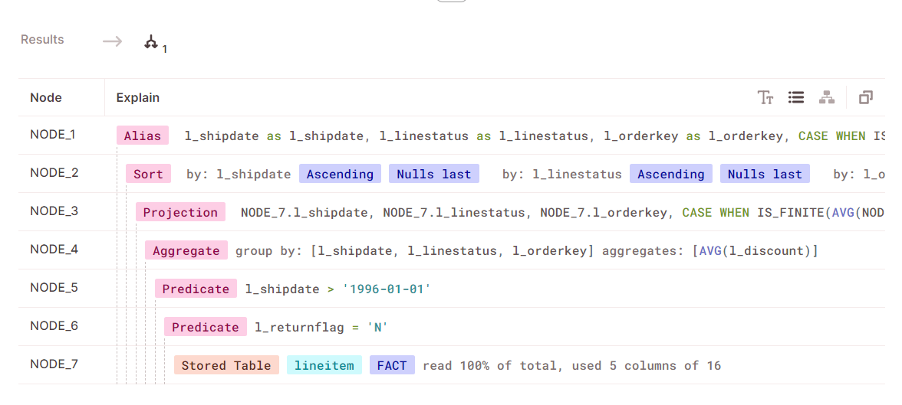

# EXPLAIN

`EXPLAIN` returns the execution plan for a specified query statement without running it. `EXPLAIN` can help you identify opportunities to tune query performance before you run a query.

By default, `EXPLAIN` returns output in JSON format. The SQL workspace uses the JSON to present diagram views of the execution operations in the query plan.You can choose different views. You can also use the SQL workspace to analyze a query plan after a query runs without using the `EXPLAIN `statement.

For more information, see [Using explain to analyze query execution](../../work-with-our-sql-editor/using-explain-to-analyze-query-execution.md).

**Syntax**

```sql
EXPLAIN [USING {TEXT|JSON}] <query_statement>
```

<style>
table th:first-of-type {
    width: 30%;
}
table th:nth-of-type(2) {
    width: 70%;
}
</style>

| Parameter | Description |
| :--------- | :---------- |
| `[USING {TEXT|JSON}]`  | Defaults to `JSON`. This parameter determines the output format for the view. If `USING TEXT` is specified, the list view and graph view are not available. |
| `<query_statement>`    | Any query statement that does not include DDL commands.|

**Example**

The example below demonstrates an `EXPLAIN` statement for a `SELECT` query on a table named `lineitem`.

```sql
EXPLAIN
SELECT
	l_shipdate,
	l_linestatus,
	l_orderkey,
	AVG(l_discount)
FROM
	lineitem
WHERE
	l_returnflag = 'N'
	AND l_shipdate > '1996-01-01'
GROUP BY
	l_shipdate,
	l_linestatus,
	l_orderkey
ORDER BY
	1,2,3,4;
```

After the statement runs, Firebolt shows a list of query execution plan nodes (or steps) in descending order of execution. The last plan node to execute is shown at the top of the list.



The `EXPLAIN` results indicate that this `SELECT` query will execute operations as follows. The Firebolt engine will:

1. Filter the `lineitem` table for columns used in the `SELECT` query, and then by the `WHERE` conditions.
2. Perform the aggregation as specified by the `GROUP BY` clause.
3. Sort results in ascending order by the `l_shipdate` column, as specified by the `ORDER BY` clause.
