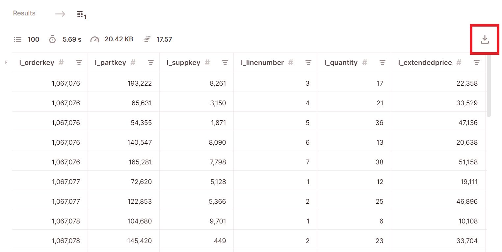

# Copying query results

Firebolt has two ways to export query data to use and analyze outside of Firebolt. You can use the SQL workspace to save query results to your local hard drive as `JSON` or `CSV`, or you can use DML to write to an Amazon S3 location, which gives you more flexible output options.

## Using the SQL workspace to export results to a local hard drive

1. After you run a query in the SQL workspace, choose the download icon (see image below).  

2. Choose **Export table as CSV** or **Export table as JSON**.  
Firebolt downloads the file type that you chose to the default download location for your browser.  


{: .note}
The SQL workspace has a maximum export limit of 10,000 rows.

## Copying results to S3 (Beta)

You can use the `COPY TO` statement to export query results to S3 in `CSV`, `TSV`, `JSON`, or `PARQUET`. Files are compressed in GZIP format by default. You can use the `COMPRESSION` clause to turn off compression. ‌

The example below demonstrates a `COPY TO` statement that exports the results of a query as an un-compressed Parquet file to the S3 location `s3://my_bucket/my_folder`. The AWS principal associated with the specified `CREDENTIALS` must be allowed to write to the S3 location specified. For more information, see [`COPY TO`](../sql-reference/commands/dml-commands.md#copy-to).

```sql
COPY (
  SELECT
    l_orderkey
  FROM   
    lineitem
  WHERE  
    l_partkey = 124817)
  TO 's3://my_bucket/my_folder'
    TYPE = PARQUET
    CREDENTIALS = (AWS_KEY_ID = ****** AWS_SECRET_KEY = ******)       
    COMPRESSION = NONE;
```

To write query results to the specified S3 location, Firebolt requires additional permissions specified in an IAM permissions policy. The permissions policy statement below allows the minimum actions required for Firebolt to save query results to an Amazon S3 bucket. Replace `<my_bucket>` with the name of your S3 location.

```
{
    "Version": "2012-10-17",
    "Statement": [
        {
            "Effect": "Allow",
            "Action": [
                "s3:Get*",
                "s3:List*",
                "s3:PutObject",
                "s3:DeleteObject"
            ],
            "Resource": [
                "arn:aws:s3:::<my_bucket>",
                "arn:aws:s3:::<my_bucket>/*"
            ]
        }
    ]
}
```

When using a `COPY TO` statement to export query results, you must include the Role ARN for the required `CREDENTIALS` parameter. See the example below:

```
COPY 	(
	SELECT *
	FROM test_table
	LIMIT 100
	)
	TO 's3://my_bucket/'
	CREDENTIALS = (AWS_ROLE_ARN = '*******');
```

For more information on setting up an IAM role and permissions, please refer to our guide on [AWS roles](../loading-data/configuring-aws-role-to-access-amazon-s3.html).
